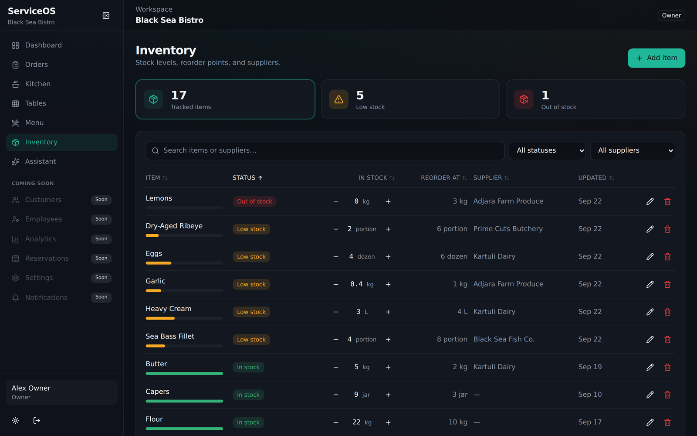
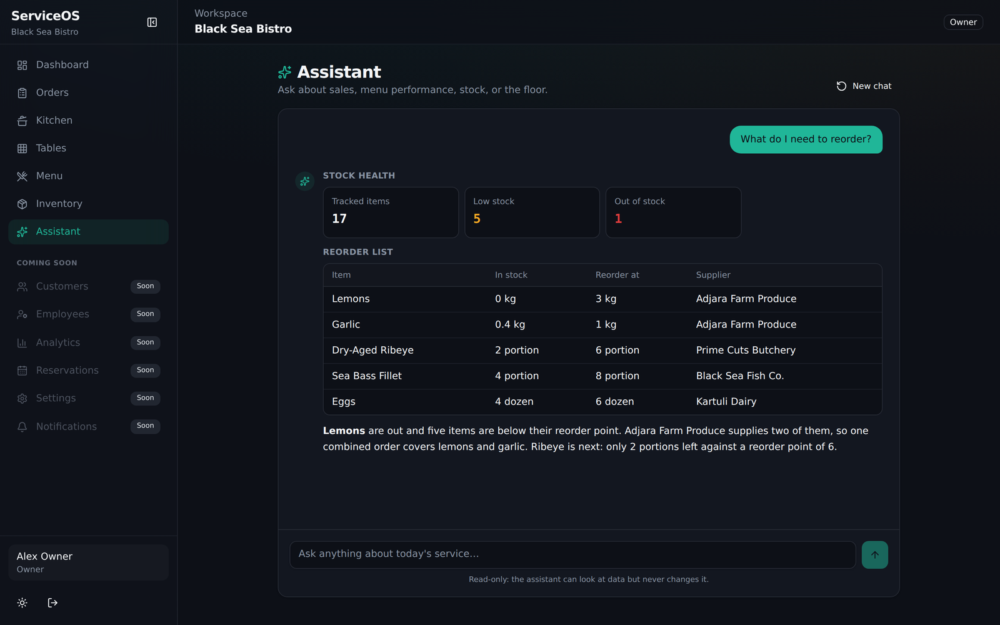
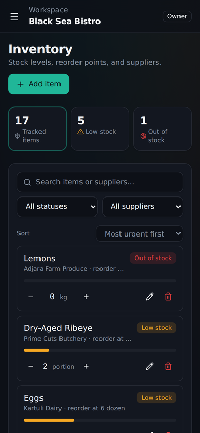
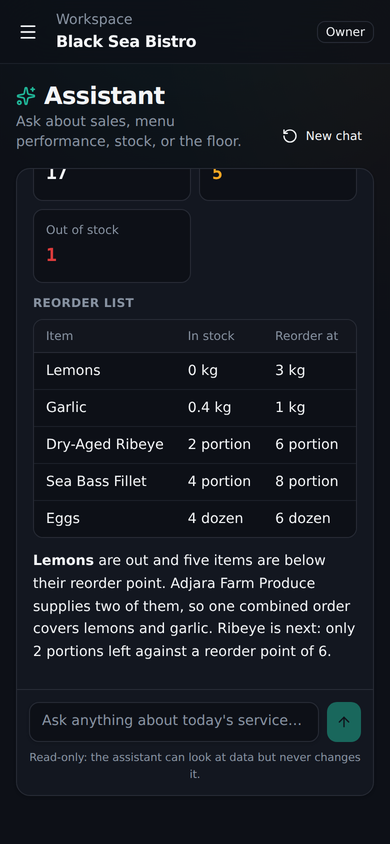
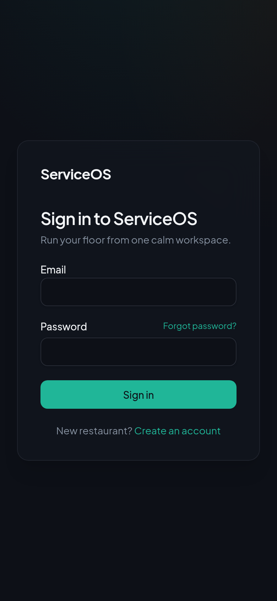

# ServiceOS — Restaurant Management SaaS

[](https://github.com/Davitxxdavit/ServiceOS/actions/workflows/ci.yml)

Multi-tenant restaurant operations app: live orders, a drag-and-drop kitchen board, a table floor plan, menu management, inventory with reorder alerts, and an **AI assistant that streams answers over live restaurant data**. Each restaurant is isolated with Supabase row-level security, and permissions for five staff roles (owner, manager, chef, waiter, cashier) are enforced in the database.





<p>
  
  
  
</p>

> Screenshots use the seeded demo restaurant.

## Highlights

- **Security in the database, not the UI.** RLS policies plus `has_permission()` checks mean a waiter can't write inventory even by calling the API directly. The AI assistant runs with the caller's JWT, so it can only see what that user can see.
- **AI assistant with streaming + tool calling.** A Supabase Edge Function runs a Claude tool-use loop over four read-only data tools and streams Server-Sent Events. The model returns structured JSON (`show_metrics`, `show_table`) that is validated with Zod on the client before rendering — malformed output is dropped, never rendered. Works without an API key in a templated demo mode.
- **Data table done properly.** Search, status and supplier filters, sortable columns, pagination, optimistic `+/-` stock updates with rollback, and table state in the URL so filtered views can be bookmarked.
- **Realtime.** Orders, kitchen and tables update live through Supabase Realtime.
- **Responsive.** Mobile navigation drawer, card layouts for tables on small screens.
- **Tested.** Vitest + React Testing Library for table logic, schemas, the SSE parser, the chat reducer and page behaviour; Deno tests for the model-stream parser, the demo-mode router and the sales math. CI runs lint, typecheck, tests and build on every push.

## Stack

- **Frontend:** React 19, TypeScript, Vite, Tailwind CSS, TanStack Query, Zustand, React Router, React Hook Form, Zod, Recharts, dnd-kit, Framer Motion
- **Backend:** Supabase — Postgres, Auth, RLS, Realtime, Storage, Edge Functions (Deno)
- **AI:** Claude via the Messages API (tool use + streaming)
- **Quality:** Vitest, Testing Library, oxlint, GitHub Actions

## Modules

| Module | Status |
|--------|--------|
| Auth (login, signup, verify, forgot/reset) | Done |
| Dashboard | Done |
| Orders + realtime | Done |
| Kitchen Kanban (drag-and-drop + timers) | Done |
| Tables floor | Done |
| Menu CRUD + images | Done |
| Inventory (stock, reorder points, suppliers) | Done |
| AI assistant (streaming, tool calling) | Done |
| Customers / Employees / Analytics / Reservations / Settings | Schema + RLS ready, UI planned |

## Run locally

Everything runs on your machine: no hosted Supabase project, no paid services. Verified on Windows 11 (PowerShell) with Node 22, Docker Desktop (Engine 29) and Supabase CLI 2.117 (run through `npx`, nothing to install globally).

Requires **Node 20.19+** and **Docker Desktop** (running). Commands are run from the repo root unless noted.

```powershell
# 1. Start the local Supabase stack: Postgres, Auth, REST, Realtime, Storage, Studio and Edge Functions.
#    Applies backend/supabase/migrations + seed.sql. The first run pulls Docker images and takes a few minutes.
npx supabase start --workdir backend

# 2. Frontend
cd frontend
Copy-Item .env.example .env   # already points at http://127.0.0.1:54321 with the local anon key
npm install
npm run dev
```

Open http://localhost:5173 and sign in as **owner@serviceos.demo / ServiceOS!Demo1**.

The `ai-assistant` Edge Function is served by `supabase start` itself (no separate `functions serve` needed) and hot-reloads when you edit it.

| URL | What |
|-----|------|
| http://localhost:5173 | App (Vite) |
| http://127.0.0.1:54321 | Supabase API gateway (REST, Auth, Functions) |
| http://127.0.0.1:54323 | Supabase Studio (browse tables, add users) |
| http://127.0.0.1:54324 | Mailpit (auth emails, e.g. sign-up / password reset) |

Useful commands (repo root):

```powershell
npx supabase db reset --workdir backend   # re-apply migration + seed (wipes local data)
npx supabase status --workdir backend     # print URLs and local keys
npx supabase stop --workdir backend       # stop the stack (data is kept in Docker volumes)
```

The root `package.json` wraps these as `npm run supabase:start`, `supabase:reset`, `supabase:stop` and `npm run dev`.

**Trying a read-only role:** the seed has one owner. To see RLS in action, add a user in Studio (Authentication → Add user, auto-confirm), then insert an `employees` row for restaurant `33333333-3333-3333-3333-333333333333` with the Chef role (`11111111-1111-1111-1111-111111111003`). That user sees inventory without any write buttons, and direct API writes are rejected by Postgres.

**Troubleshooting**

- `JWT issued at future` (PGRST303) right after sign-in: Docker Desktop's VM clock drifted, usually after the PC slept. Reload the page; if it persists, restart Docker Desktop.
- Port already in use: another local Supabase project is running. Stop it with `npx supabase stop --project-id <id>` or change the ports in `backend/supabase/config.toml`.

### AI assistant

Works out of the box in **demo mode**: templated answers built from live data, no API key and no cost. Setting an `ANTHROPIC_API_KEY` switches to real Claude answers (this is a paid API, so it is optional):

```powershell
Set-Content backend/supabase/functions/.env "ANTHROPIC_API_KEY=sk-ant-..."   # git-ignored
npx supabase functions serve ai-assistant --workdir backend --env-file backend/supabase/functions/.env
```

See [backend/supabase/functions/README.md](backend/supabase/functions/README.md) for the event protocol.

## Scripts (in `frontend/`)

| Command | What it does |
|---------|--------------|
| `npm run dev` | Vite dev server |
| `npm test` | Unit + component tests |
| `npm run lint` | oxlint |
| `npm run typecheck` | TypeScript project build |
| `npm run build` | Typecheck + production build (routes are code-split) |

## Project structure

```
frontend/src/
  features/<module>/     components · hooks · services · types · lib (pure, tested logic)
  components/ui/         shared UI primitives
  layouts/ routes/ store/ lib/
backend/supabase/
  migrations/            schema + RLS + storage (applied by `supabase start`)
  functions/ai-assistant Edge Function: tool loop, SSE streaming, demo mode
  seed.sql               demo restaurant, menu, orders, inventory, suppliers
```

## Docs

- [Architecture](docs/architecture.md)
- [RBAC](docs/rbac.md)
- [Setup](docs/setup.md)
- [ERD](docs/erd.md)

## Deploy

- Frontend → Vercel (root `frontend`, set `VITE_SUPABASE_URL` / `VITE_SUPABASE_ANON_KEY`)
- Database → `supabase db push`; Edge Function → `supabase functions deploy ai-assistant` + `supabase secrets set ANTHROPIC_API_KEY=...`

Never commit service-role or model API keys. The frontend uses the anon key only; authorization is enforced by RLS.
